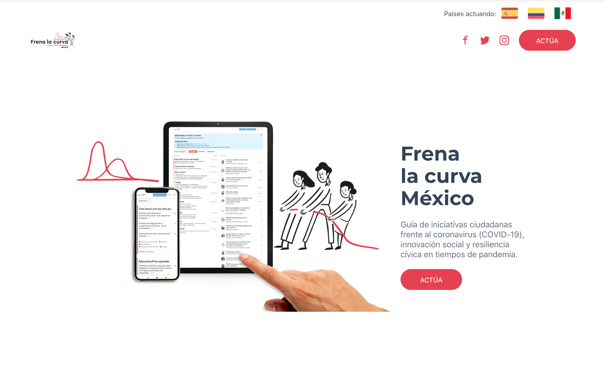

 

# Frena La Curva México - Landing page

Este repositorio contiene la landing page para México trabajando con <frenalacurva.net>.

Puedes ver el demo [aquí](mexico.frenalacurva.net).

### Requerimientos

Para utilizar esta plantilla, tu computadora necesita:

- Node.js. Para armar los paquetes. (https://nodejs.org/en/download/)
- Prueba usando `node -v` en la terminal
- npm. Usado para gestionar las dependencias.
- Prueba usando `npm -v` en la terminal
- Gulp. Es un _task runner_.
  `npm install -g gulp`
- Prueba usando `gulp -v` en la terminal

### Instalación:

- Instala los paquetes de node: `npm install`
- Corre `gulp dev`
- Tu sitio está visible en el URL: http://localhost:3000
- **Nota:** Modifica sólo los archivos en la carpeta `src/`

### Desarrollo con Docker

Para hacer y probar cambios locales en el contenido, estilos, imagenes, etc. puedes usar un contenedor docker.

- `docker build . -t frenalacurva:dev`
- `docker run --rm -it --init -p 3000:3000 -v $PWD/src/:/app/src frenalacurva:dev`
- Tu sitio está visible en el URL: http://localhost:3000

#### Usar docker-compose (1.20+)

- `docker-compose up`
- Tu sitio está visible en el URL: http://localhost:3000

> Si necesitas cambiar algun archivo fuera de `./src` solo vuelve a ejectuar ambos comandos.

### Deployment en gh-pages:

- Una vez hayas concluido el desarrollo, deberás cambiar la carpeta `dist/` que se generó por `docs/`:  
  `mv dist/ docs/`
- Haz un push de tus cambios al repositori
- En la sección de settings de tu repositorio, ve a la opción de GitHub Pages y selección como Source la carpeta `docs/`
- ¡Listo! Tu landing quedará servida en `<usario-u-organizacio>.github.io/<repositorio>`

### Atribuciones

- Link al repo/plantilla original: https://github.com/cssninjaStudio/fresh
- Si tienes preguntas, puedes escribir a <rodo@codeandomexico.org>
- Gracias a la comunidad es que este repositorio se mantiene vivo
